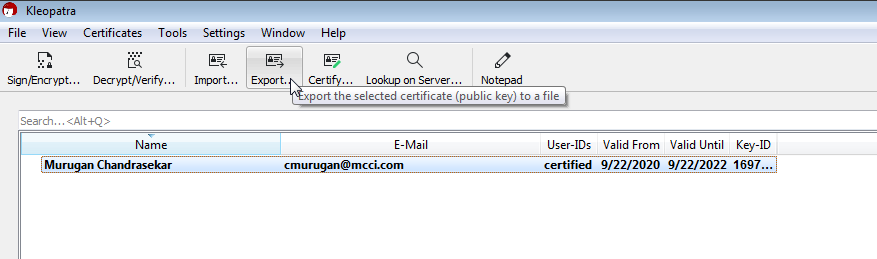

Creating PGP Key Pairs Using “gpg4win” Tool
===========================================

1.  Please click on the below link for downloading “gpg4win-3.1.13.exe” tool for
    generating PGP key pairs.

    -   https://files.gpg4win.org/gpg4win-3.1.15.exe

1.  Double click on the downloaded tool and then install it just by make sure
    the below components were selected.

    

3.  Double click on the “Kleopatra” icon on your desktop.

    

4.  To create a new key pair, click on “New Key Pair” option as shown below.

    (You can also select through “File” menu with first option “Create a
    personal OpenPGP key pair).

5.  Enter the required details of you and then click “Advanced Settings...”

6.  In Advanced Settings, change the RSA bits to 4096 bits as shown below. And
    then click “OK”

7.  Press “Enter” until you get to next window. (There might be two times you’ve
    to press “Enter”)

8.  After pressing “Enter”, you will be asked to enter password of your choice(
    please keep it secure and don’t forget it) as shown below

9.  Select the first option “Make a Backup of Your Key Pair” then you will be
    asked to enter password entered at the step 6 then save it.( please keep it
    secure; don’t share it to anyone). The second option “Send Public Key By
    Email…” is not working mostly.

10.  In order to export the PGP public key, select the profile that you just
    created and the click on the “Export…” option as shown below then save it.
    This PGP public key will be shared to whoever wants it.

